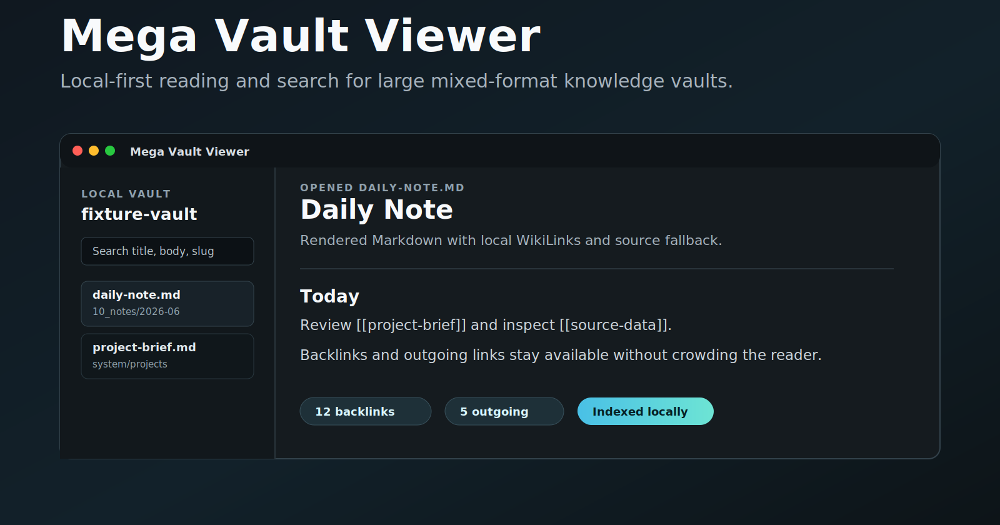
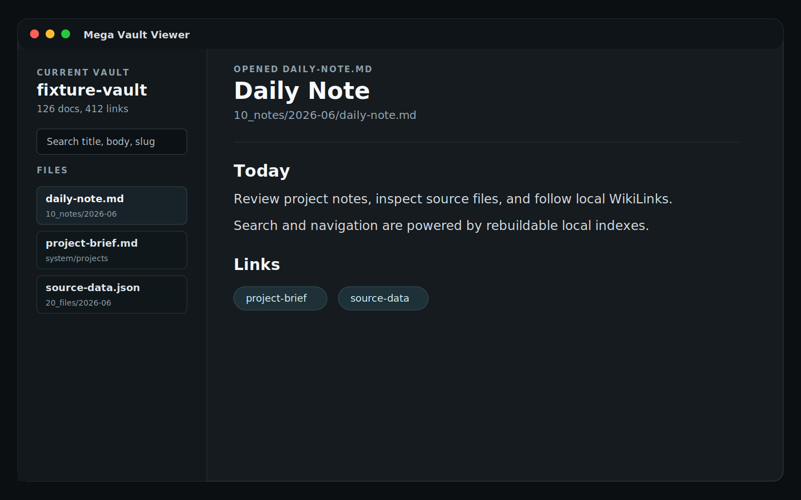

# Mega Vault Viewer



Mega Vault Viewer is a local-first macOS desktop app for reading and exploring large mixed-format knowledge vaults. It keeps your files as the source of truth and builds rebuildable local indexes for search, navigation, backlinks, and metadata views.

The app is aimed at people who like Markdown and filesystem-based knowledge work, but need faster indexed views and a calmer reader than a raw folder of notes.

## Highlights

- Open a local vault folder without uploading files to a service.
- Read Markdown notes with WikiLink navigation, frontmatter inspection, backlinks, and outgoing links.
- Browse common vault items including Markdown, YAML, JSON, JSONL, images, PDFs, and unsupported files with safe fallbacks.
- Search titles, paths, body text, and slugs through a local Tantivy index.
- Store document metadata, links, file fingerprints, and navigation state in a local SQLite shadow index.
- Keep the vault canonical: source files, media, and system files remain in their original formats.

## Current Status

Mega Vault Viewer is an MVP desktop app. It is useful for local development and fixture-based testing, but it is not yet a signed, notarized, or distributed macOS release.

Known maturity boundaries:

- macOS is the primary target.
- Builds are local developer builds unless a GitHub release explicitly provides artifacts.
- Runtime indexes are rebuildable caches, not a second source of truth.
- Editing exists for Markdown notes, but the product direction remains read-first and explicit-write-first.

## Screenshots And Demo

Public screenshots and social assets live under `assets/`. They use fixture or synthetic data only. Do not publish screenshots from a private vault.



For a safe demo vault, use:

```bash
fixtures/demo-vault
```

See [docs/visual-assets.md](docs/visual-assets.md) for the screenshot refresh workflow.

## Architecture

Mega Vault Viewer separates canonical files from runtime state:

- **Canonical vault:** Markdown notes, YAML, JSON, JSONL, images, PDFs, and other files on disk.
- **Structured runtime:** SQLite stores document ids, paths, slugs, metadata, frontmatter, links, backlinks, and file manifest state.
- **Search runtime:** Tantivy stores full-text fields tied back to SQLite document ids.
- **Desktop shell:** Tauri exposes Rust commands to a TypeScript/Vite interface.

SQLite, Tantivy, thumbnail, and render-cache artifacts are shadow state. They can be deleted and rebuilt without changing the vault.

See [docs/architecture.md](docs/architecture.md) for the current technical model.

## Privacy Model

Mega Vault Viewer is local-first:

- The app reads local files from a vault path you choose.
- The app does not require a cloud account or hosted service.
- Runtime state is stored outside the vault by default.
- Repository fixtures and screenshots must not contain private notes, client data, or personal vault paths.

See [docs/public-readiness.md](docs/public-readiness.md) for the public scrub notes.

Normal desktop runs store runtime state under the platform app data directory, for example:

```text
~/Library/Application Support/Mega Vault Viewer/
```

For development or tests, override the runtime state directory:

```bash
MEGA_VAULT_VIEWER_STATE_DIR=/tmp/mega-vault-viewer-state npm run desktop:dev
```

To prefill the vault picker during development:

```bash
MEGA_VAULT_VIEWER_DEFAULT_VAULT_PATH=/path/to/vault npm run desktop:dev
```

## Installation

There is no packaged public installer yet. For now, build from source.

Prerequisites:

- macOS
- Rust stable toolchain
- Node.js and npm
- Tauri system dependencies for macOS

Install dependencies:

```bash
npm install
```

Run the desktop app in development:

```bash
npm run desktop:dev
```

Build the macOS app bundle:

```bash
npm run desktop:build
```

The generated `.app` bundle is written under:

```text
target/release/bundle/macos/
```

## Development

The repository is a small workspace: Rust owns indexing/search/runtime behavior, while the Tauri desktop app owns the macOS shell and TypeScript UI. Most product changes should include fixture coverage in `crates/mvv-core/tests` or focused TypeScript tests under `apps/desktop/src`.

Repository layout:

```text
apps/desktop/          Tauri desktop app and TypeScript UI
crates/mvv-core/       Rust indexing, search, parsing, and runtime logic
docs/                  Architecture and release notes
fixtures/              Synthetic test vaults and reader fixtures
```

Useful commands:

```bash
cargo fmt --all -- --check
cargo test --workspace
cargo clippy --all-targets -- -D warnings
npm test --if-present
npm run build --if-present
npm run desktop:build
git diff --check
```

## Release Strategy

Releases should be explicit and evidence-backed:

1. Run the full verification suite.
2. Build the macOS app bundle.
3. Update `CHANGELOG.md`.
4. Create a Git tag.
5. Attach release artifacts only when signing/notarization status is clear.

Until a release says otherwise, builds are unsigned local builds.

See [docs/release.md](docs/release.md) for the full release runbook.

Public GitHub publishing metadata is recorded in [docs/github-publishing.md](docs/github-publishing.md).

## Security

Please report security issues privately. See [SECURITY.md](SECURITY.md).

## Contributing

Contributions are welcome when they preserve the local-first, vault-canonical model. See [CONTRIBUTING.md](CONTRIBUTING.md).

## License

Mega Vault Viewer is released under the MIT License. See [LICENSE](LICENSE).
