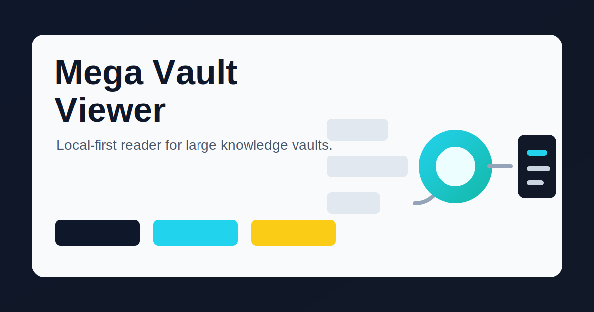

# Visual Assets

Public visuals must be safe to publish. Do not use screenshots from a private vault, customer workspace, personal note collection, or machine-local path.

## README Hero


`assets/hero.svg` is the conceptual README hero. It is intentionally not a literal product screenshot, so it stays sharp when GitHub scales it down.

## Social Preview



`assets/social-preview.svg` is the GitHub/social preview asset.

## Fixture Screenshot


`assets/screenshot-fixture-vault.svg` is the representative app screenshot. It uses synthetic fixture data only.

## Refresh Workflow

1. Use `fixtures/demo-vault` or a tiny synthetic vault.
2. Avoid real personal names, client names, private paths, tokens, and screenshots from private notes.
3. Keep hero and social preview assets simple, sharp, and conceptual. Use large text and shapes that remain readable when GitHub scales the image down.
4. Capture or generate real product screenshots separately, using synthetic fixture data only.
5. Save final assets under `assets/`.
6. Run the privacy scan from the public readiness task before publishing.

To refresh the fixture screenshot, build or run the desktop app with fixture data:

```bash
MEGA_VAULT_VIEWER_DEFAULT_VAULT_PATH="$PWD/fixtures/demo-vault" npm run desktop:dev
```

Then replace `assets/screenshot-fixture-vault.svg` with a captured PNG or updated SVG that still uses only fixture data.
